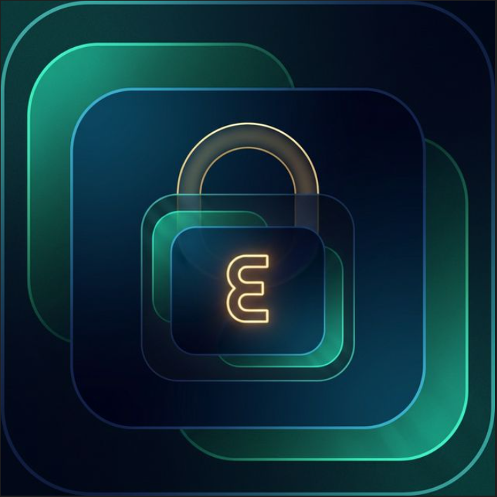

<p align="center">
  
</p>

<h1 align="center">Aegis Vault 3.0</h1>

<p align="center">
  <strong>🔐 Post-Quantum Cryptographic & Zero-Knowledge Password Manager</strong>
</p>

<p align="center">
  <a href="#features">Features</a> •
  <a href="#security">Security</a> •
  <a href="#installation">Installation</a> •
  <a href="#building">Building</a> •
  <a href="#license">License</a>
</p>

<p align="center">
  
  
  
  
  
</p>

<p align="center">
  
  
  
  
</p>

---

## 🌟 Overview

**Aegis Vault 3.0** is an industry-leading, offline-first password manager implementing **Post-Quantum Cryptography (PQC)** and a **Zero-Knowledge Architecture**. It is designed to safeguard your digital life against current threats and future quantum breakthroughs.

All data is stored locally in an encrypted vault, bound to your hardware, ensuring that **only you** hold the keys to your kingdom.

## ✨ Key Features

### 🔒 **Advanced Security**
- **ML-KEM-768 (Kyber)**: NIST-standardized quantum-resistant asymmetric encryption.
- **AES-256-GCM**: Military-grade symmetric encryption for vault records.
- **Argon2id**: State-of-the-art key derivation with hardware-specific salt (Hardware Binding).
- **RSA Digital Signatures**: Secure **Lifetime License** verification using embedded public keys.
- **TPM Support**: Integrity checks and secure time-stamping via hardware TPM chips.
- **Zero-Knowledge Architecture**: Your master password and keys never leave your device.

### 🔑 **Licensing & Hardware Binding**
- **Hardware-Unique Device ID**: Each installation is bound to the physical hardware (Motherboard UUID/Machine ID).
- **Lifetime License System**: Cryptographically signed licenses (Base64) for premium access.
- **Trial Period**: 3-day full-feature trial automatically enabled on installation.
- **Secure Activation**: Built-in verification against the specific Hardware ID.

### 💻 **Multi-Platform Support**
- **Windows**: Full support with Windows Hello and Bitlocker-aware protection.
- **macOS**: Native Silicon (M1/M2/M3) & Intel support with Touch ID integration.
- **Linux**: Secure AppImage & DEB packages with fprintd support.

### 🌐 **Browser Extensions**
- **Chrome & Firefox**: Native messaging host integration for seamless auto-fill without compromising security.

### 🎨 **Premium UI/UX**
- **Advanced Dashboard**: Real-time premium status widgets, trial progress gauges, and Hardware ID display.
- **Modern Aesthetics**: Glassmorphism dashboard with fluid animations and premium iconography.
- **Multilingual**: Full Turkish and English localization with instant switching.
- **Offline Breach Monitor**: Check 600+ million leaked passwords locally using K-Anonymity privacy.

## 🏗️ Technical Architecture

> 📄 **For a deep dive into our Post-Quantum Cryptography and P2P Sync protocol, read the [Technical Whitepaper / Teknik İnceleme](WHITEPAPER.md).**

```
┌─────────────────────────────────────────────────────────────┐
│                     Electron (Main Process)                  │
├─────────────────────────────────────────────────────────────┤
│                                                              │
│  ┌──────────────┐  ┌──────────────┐  ┌──────────────┐      │
│  │   React UI   │  │   IPC Bridge │  │ Security Mngr│      │
│  │  (Renderer)  │  │  (Encrypted) │  │  (TPM/Bio)   │      │
│  └──────────────┘  └──────────────┘  └──────────────┘      │
│                                                              │
├─────────────────────────────────────────────────────────────┤
│                   Native Module (Rust/Neon)                  │
├─────────────────────────────────────────────────────────────┤
│                                                              │
│  ┌──────────────┐  ┌──────────────┐  ┌──────────────┐      │
│  │  ML-KEM-768  │  │   AES-256    │  │   Argon2id   │      │
│  │     (PQC)    │  │    (GCM)     │  │   (KDF)      │      │
│  └──────────────┘  └──────────────┘  └──────────────┘      │
│                                                              │
│  ┌──────────────┐  ┌──────────────┐  ┌──────────────┐      │
│  │  SQLCipher   │  │   Hardware   │  │   Memory     │      │
│  │  (Database)  │  │   Binding    │  │   Sanitize   │      │
│  └──────────────┘  └──────────────┘  └──────────────┘      │
│                                                              │
└─────────────────────────────────────────────────────────────┘
```

## �️ Security Pipeline (CI/CD)

Aegis Vault undergoes rigorous automated security testing on every commit:
- **SAST (Semgrep)**: Static analysis for Electron/Node.js security patterns.
- **Secret Scanning (Gitleaks)**: Prevents accidental credential leaks in source code.
- **Dependency Audit (Rust Audit / NPM)**: Scans for vulnerabilities in third-party libraries.
- **DAST (OWASP ZAP)**: Dynamic application security testing of the renderer.

## 📦 Installation

Visit the [Releases](https://github.com/hafgit99/aegisv3.0.0/releases) page to download the latest stable version for your platform.

## 🔧 Development

### Prerequisites
- **Node.js**: 20.x or higher
- **Rust**: 1.75.x or higher
- **C++ Build Tools**: (Windows: Visual Studio Tools, macOS: Xcode, Linux: build-essential)

### Build Commands
```bash
npm install           # Install dependencies
npm run build:native  # Compile Rust native module
npm run build         # Build Renderer and Main
npm run dev           # Start development mode
```

## 📄 License

Licensed under the **MIT License**. See [LICENSE](LICENSE) for details.

---

## 🇹🇷 Türkçe Özet

**Aegis Vault 3.0**, dijital güvenliğinizi hem bugünkü hem de gelecekteki kuantum tehditlerine karşı korumak için tasarlanmış **Kuantum Sonrası Kriptografi (PQC)** ve **Sıfır Bilgi (Zero-Knowledge)** mimarisine sahip üst düzey bir şifre yöneticisidir.

### ✨ Öne Çıkanlar
- **ML-KEM-768 Koruması**: NIST standartlarında kuantum dirençli şifreleme.
- **RSA Dijital İmzalı Lisans**: Çevrimdışı doğrulanabilen ömür boyu lisanslama sistemi.
- **Donanım Bağlama (Hardware ID)**: Kasanızı ve lisansınızı cihazınızın anakart ve işlemci kimliğine mühürleyen özel güvenlik katmanı.
- **Ömür Boyu Premium**: 3 günlük deneme süresi ve ardından kalıcı aktivasyon seçeneği.
- **Biyometrik Giriş**: Windows Hello ve macOS Touch ID ile hızlı ve güvenli erişim.
- **Çevrimdışı İhlal Kontrolü**: Verilerinizi internete göndermeden, 600 milyondan fazla sızdırılmış şifreyi yerel olarak tarayın.

<p align="center">
  Made with ❤️ by <a href="https://github.com/hafgit99">hafgit99</a>
</p>

<p align="center">
  <a href="https://hetech-me.space">Web Sitesi</a> •
  <a href="https://github.com/hafgit99/aegisv3.0.0/issues">Hata Bildir</a>
</p>

